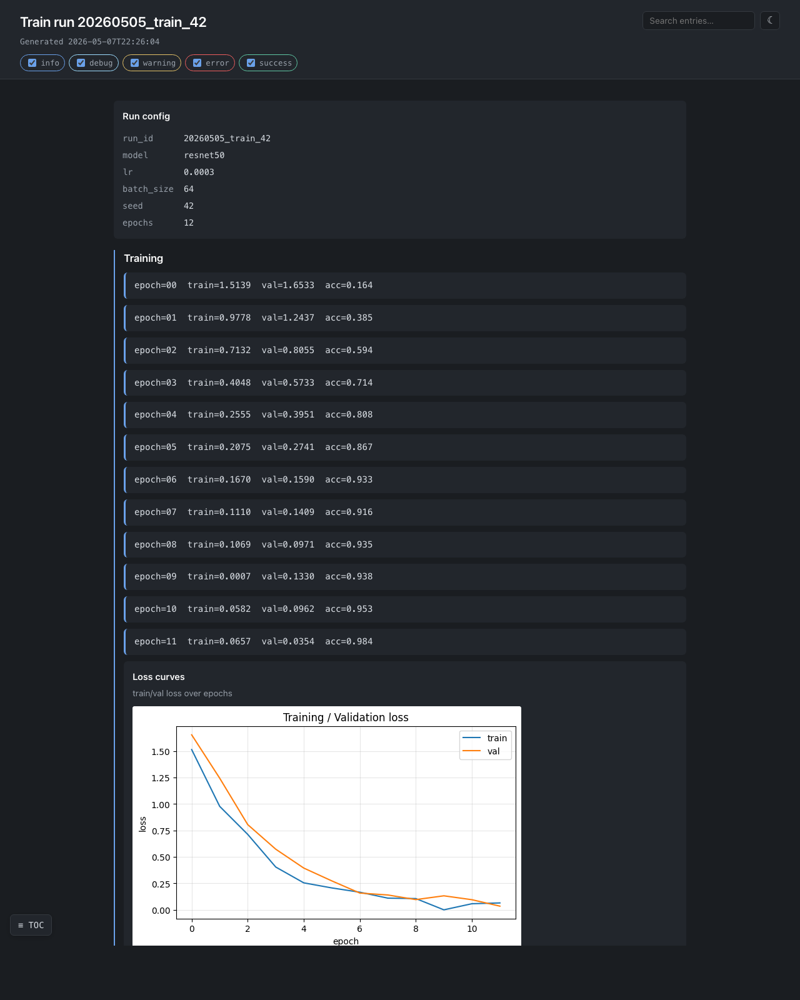
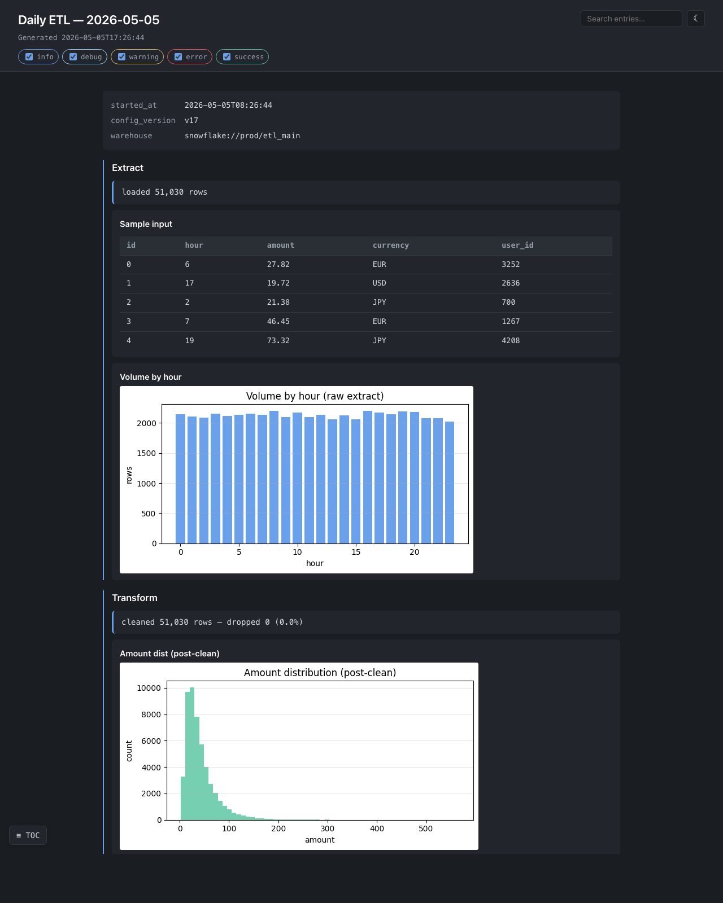
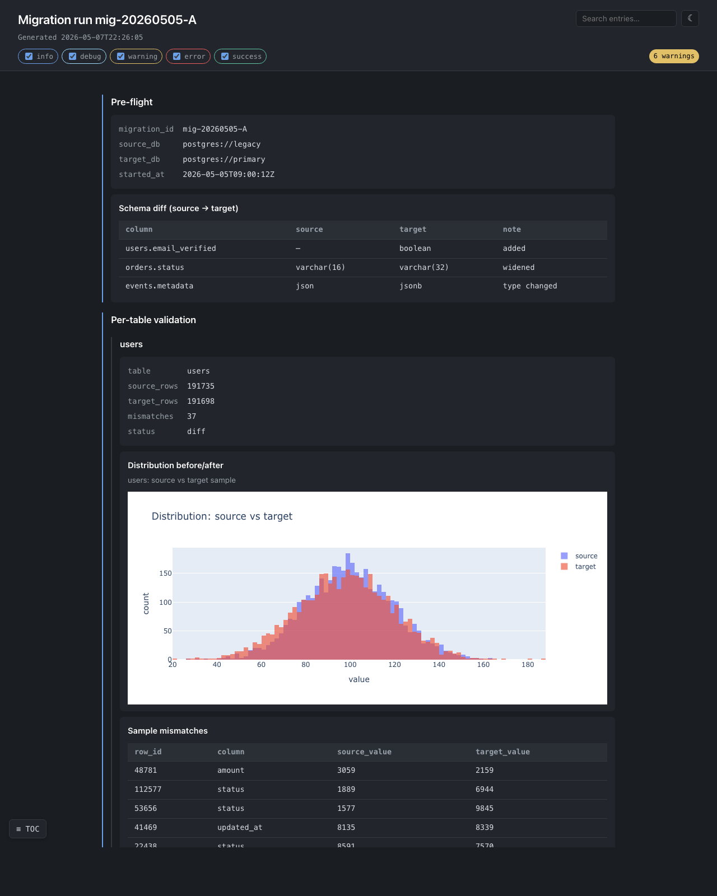
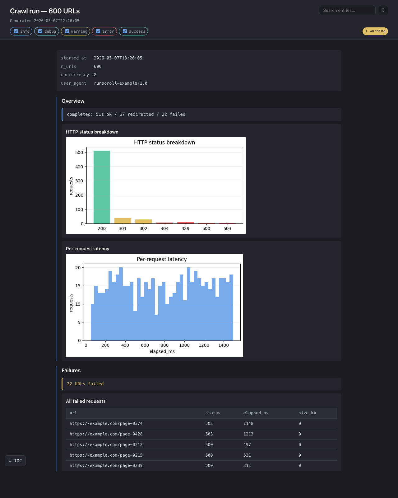

# runscroll

> **runscroll — turn one batch run into one scrollable HTML report.**
>
> Sprinkle `report.add_*()` calls through your batch job. Get a single
> self-contained HTML file out the other side. Mail it, drop it in S3,
> attach it to a PR. No server. No account. No infrastructure.



## When to use this

| Your situation                                          | runscroll? |
| ------------------------------------------------------- | ---------- |
| Batch job ran, want to share what happened              | ✅          |
| Daily ETL done, mail a result page to oncall            | ✅          |
| ML training run done, drop a post-mortem in the PR      | ✅          |
| Migration finished, link an audit page from a ticket    | ✅          |
| Crawler finished, browse failures in one HTML           | ✅          |
| Live monitoring dashboard                               | ❌ Grafana / Datadog |
| Compare 50 experiment runs                              | ❌ MLflow / Weights & Biases |
| Interactive notebook for exploration                    | ❌ Jupyter |
| Real-time streaming logs                                | ❌ stdlib `logging` |
| Generic HTML page builder                               | ❌ `dominate` / `yattag` |

If your row above says "❌", that other tool is the right fit — runscroll is
intentionally narrow.

## Install

```bash
pip install runscroll                                # core, stdlib only
pip install "runscroll[matplotlib,plotly,pil]"       # with adapters
```

## 30-second example

```python
from runscroll import Collector

with Collector("report.html", title="Daily ETL") as report:
    report.add_kv({"started_at": "2026-05-05T09:00", "config": "v17"})

    with report.section("Extract"):
        report.add_text(f"loaded {len(rows):,} rows")
        report.add_table(rows[:5], title="Sample input")

    with report.section("Transform"):
        report.add_text("dropped 142 rows (0.3%)", level="warning")
        report.add_table(dropped[:20], title="Sample dropped rows")

    report.add_text("done", level="success")
```

That produces `report.html` — one file, no assets folder, no external CDN.
Open it in any browser, mail it, upload it to S3, attach it to a PR.

## API surface (the entire library)

```python
Collector(path, title, mode="inline"|"directory", asset_writer=None, log_exceptions=True)
    # context manager: with Collector(...) as report: ...

report.add_text(text, level="info"|"debug"|"warning"|"error"|"success")
report.add_kv(mapping, title="")
report.add_code(code, lang="", title="")
report.add_table(list_of_dicts_or_lists, title="")
report.add_image(bytes_or_path_or_PIL_or_ndarray, caption="", title="")
report.add_figure(matplotlib_or_plotly_figure, title="", description="", close=True)

with report.section(name):              # nested allowed
    ...
```

That's it. The whole library is one class with eight methods.

## Output modes

```python
# inline (default) — one .html file, all assets base64'd in
Collector("report.html", mode="inline")

# directory — index.html + assets/ folder; works as a static site
Collector("report/", mode="directory")

# directory + custom destination — plug in S3 / GCS via AssetWriter
Collector("report/", mode="directory", asset_writer=MyS3Writer(...))
```

The `AssetWriter` protocol is one method:

```python
class AssetWriter(Protocol):
    def write(self, relative_path: str, content: bytes) -> None: ...
```

That's all the library asks. Authentication, region, retries, caching are
your concern — runscroll never imports a cloud SDK.

## Recipes

Working scripts in `examples/` — drop them next to your pipeline as a
starting point.

### ML training run — [examples/ml_training_run.py](examples/ml_training_run.py)


Loss curves, confusion matrix, per-class precision/recall, sample worst
predictions as inline images. Exercises matplotlib + numpy + PIL + nested
sections.

```python
with Collector(out, title=f"Train run {run_id}") as report:
    report.add_kv({"model": "resnet50", "lr": 3e-4, "bs": 64, "seed": 42})
    with report.section("Training"):
        for epoch in range(epochs):
            report.add_text(f"epoch={epoch}  train={tl:.4f}  val={vl:.4f}")
        report.add_figure(plot_loss_curves(history), title="Loss curves")
    with report.section("Holdout"):
        report.add_figure(plot_confusion(y_true, y_pred), title="Confusion")
        report.add_table(per_class_metrics, title="Per-class metrics")
```

### Daily ETL — [examples/data_quality_etl.py](examples/data_quality_etl.py)



Hourly volume, drop-rate warning with a sample of dropped rows, post-clean
distribution. The single-file output ships in a mail attachment.

### Migration validation — [examples/migration_validation.py](examples/migration_validation.py)



Per-table validation with **interactive plotly distributions** — zoom,
pan, hover tooltips, all in the single self-contained file. The plotly
bundle is inlined exactly once even when there are dozens of figures.
The `6 warnings` badge in the top-right corner is generated client-side
by counting `rs-text-warning` entries.

### Web crawler — [examples/web_scraper.py](examples/web_scraper.py)



Status-code breakdown, per-request latency histogram, every failed URL
in a browsable table.

## How memory stays flat

Each `add_*` call serializes its content to disk and flushes immediately.
**There is no in-memory entry buffer.** A 500 MiB report uses the same
RAM as a 5 KiB one — only a counter, a section-depth integer, and a file
handle live in Python.

This is the design's first-priority guarantee. The test
`tests/test_streaming_memory.py` keeps it honest: 30 × 10 MiB writes must
leave less than `total_written / 30` resident, and a 30 MiB on-disk image
streamed through `add_image` must not grow RSS by more than 1 MiB.

## What this library is NOT

- ❌ A live monitoring dashboard — Grafana / Datadog.
- ❌ A multi-run experiment tracker — MLflow / Weights & Biases.
- ❌ An interactive notebook — Jupyter.
- ❌ A general HTML builder — `dominate` / `yattag`.
- ❌ A cloud SDK wrapper — supply your own `AssetWriter`.
- ❌ A static site generator — Sphinx / mkdocs.

## License

MIT.
